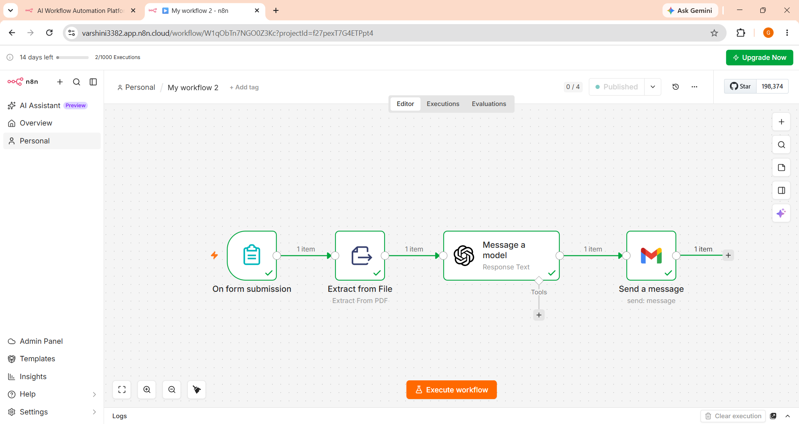

# 📄 AI Resume Analyzer Workflow (n8n)

An AI-powered Resume Analyzer workflow built using **n8n** that automatically extracts resume content, analyzes it using an AI model, and sends the analysis report to the user's email.

## 🚀 Project Overview

This workflow automates the resume screening process by:

- Accepting resume submissions through an n8n form
  
- Extracting text from PDF resumes

- Analyzing the resume using an AI language model
  
- Generating feedback on skills, experience, strengths, and improvement areas

- Sending the analysis report to the user's email automatically

This project helps recruiters, students, and job seekers quickly evaluate resumes without manual effort.

## 🛠️ Workflow Architecture

Form Submission
       │
       ▼
Extract Text from PDF
       │
       ▼
AI Resume Analysis
       │
       ▼
Email Analysis Report

## ✨ Features

- 📄 Upload resume in PDF format
  
- 🤖 AI-powered resume analysis
  
- 🔍 Extracts resume text automatically
  
- 📊 Provides detailed feedback
  
- 📧 Sends results via Gmail
  
- ⚡ Fully automated using n8n

## 🧰 Technologies Used

- n8n
  
- OpenAI / AI Model
  
- Gmail API
  
- PDF Text Extractor
  
- Workflow Automation

## 📋 Workflow Steps

### 1. Form Submission

- User uploads a resume through an n8n form.

### 2. Extract from File

- Reads the uploaded PDF.
  
- Extracts all text from the document.

### 3. AI Analysis

The AI evaluates:

- Resume Summary
  
- Technical Skills
  
- Soft Skills
  
- Education
  
- Projects
  
- Experience
  
- ATS Compatibility
  
- Strengths
  
- Weaknesses
  
- Suggestions for Improvement

### 4. Email Report

The generated analysis is automatically sent to the user's email.

## 📁 Workflow Screenshot

## 🎯 Use Cases

- Resume Screening
  
- ATS Resume Review
  
- Student Resume Evaluation
  
- Recruitment Automation
  
- Career Guidance

## 📈 Future Enhancements

- ATS Score (0–100)
  
- Skill Gap Analysis
  
- Job Role Recommendation
  
- Resume Ranking
  
- Multi-language Support
  
- DOCX Support
  
- Resume Comparison
  
- Keyword Matching

## 📂 Project Structure

Resume-Analyzer-Workflow/

├── README.md

├── workflow.json

├── images/

│   └── workflow.png

└── sample_resume.pdf

## ▶️ How to Run

1. Install n8n.
   
2. Import the workflow JSON.
  
3. Configure:
   
   - OpenAI API credentials
     
   - Gmail credentials
     
4. Activate the workflow.
   
5. Submit a resume through the form.
   
6. Receive the AI-generated analysis via email.

Feel free to fork this repository, improve the workflow, and submit a pull request.
t forget to **Star** this repository!

### n8n Workflow link

https://varshini3382.app.n8n.cloud/form/e10abce5-b149-42f2-9d02-a544937d2032
